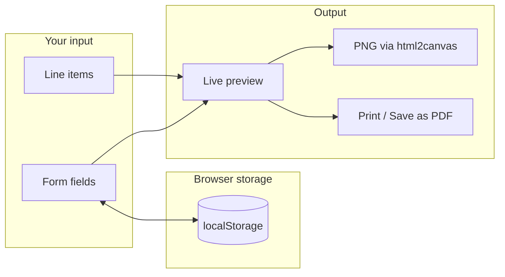

<div align="center">


# Invoice Generator

**Create polished invoices in the browser** — live preview, collapsible sections, PNG export, and print-to-PDF.

[](LICENSE)
[](index.html)

</div>

---

## Overview

A static, client-only invoice builder with a glass-style editor on the left and a print-ready **live preview** on the right. Company defaults and logo persist in **`localStorage`**; line items reset when you refresh (by design).



---

## Screenshots

Replace these placeholders with your own captures for a richer README.

| Editor (collapsible sections) | Preview + toolbar |
| ----------------------------- | ----------------- |
| _Drop `assets/screenshot-editor.png` here_ | _Drop `assets/screenshot-preview.png` here_ |

Tip: capture at **~1200px** width for a clean GitHub render.

---

## Features

| Feature | Description |
| ------- | ----------- |
| **Collapsible panels** | Company, invoice, line items, and totals/footer expand/collapse for a cleaner workflow |
| **Live preview** | Updates as you type; sticky on wide screens |
| **Preview toolbar** | **Copy total** copies the grand total; **Focus preview** smooth-scrolls to the invoice |
| **Logo** | Upload with natural, circle, or square framing |
| **Currencies** | USD, EUR, GBP, INR, JPY with correct symbols |
| **Tax & discount** | Percent-based; totals recalculate instantly |
| **Export** | **Save PDF** / **Print** → system dialog (choose “Microsoft Print to PDF” or similar); **Save PNG** rasterizes the preview |

<details>
<summary><strong>Interactive README tips</strong> (click to expand)</summary>

This file uses collapsible sections and a Mermaid diagram so the repo reads well on **GitHub** and similar hosts. If Mermaid does not render in your viewer, open the file on GitHub.com or use a Mermaid-compatible preview.

</details>

---

## Quick start

1. Clone or download this repository.
2. Open **`index.html`** in a current browser (Chrome, Edge, Firefox, Safari).

<details>
<summary><strong>Optional: local static server</strong></summary>

Some browsers restrict clipboard or canvas behavior on `file://`. From the project folder:

```bash
npx --yes serve .
```

Then open the URL shown in the terminal (often `http://localhost:3000`).

</details>

---

## Project layout

| Path | Role |
| ---- | ---- |
| [`index.html`](index.html) | Markup: form, collapsible `<details>`, preview, toolbar |
| [`index.css`](index.css) | Glass UI, responsive grid, print rules |
| [`script.js`](script.js) | Preview sync, items, `localStorage`, PNG, copy total |
| [`assets/readme-hero.svg`](assets/readme-hero.svg) | README banner illustration |
| [`LICENSE`](LICENSE) | **MIT License** |

---

## Tech stack

- [GSAP](https://greensock.com/gsap/) (CDN) — entrance animation  
- [html2canvas](https://html2canvas.hertzen.com/) (CDN) — PNG export  
- [Outfit](https://fonts.google.com/specimen/Outfit) (Google Fonts)

No bundler, npm install, or backend required.

---

## License

This project is released under the **MIT License** — see [`LICENSE`](LICENSE).


You may reuse, modify, and distribute the code with attribution per the license text. Update the copyright line in `LICENSE` if you fork under a different name.

---

## Disclaimer

The UI label “ZOHO INVOICE” is **cosmetic styling only** and is not affiliated with Zoho Corporation. Rename it in `index.html` if you need a neutral or your own brand.
