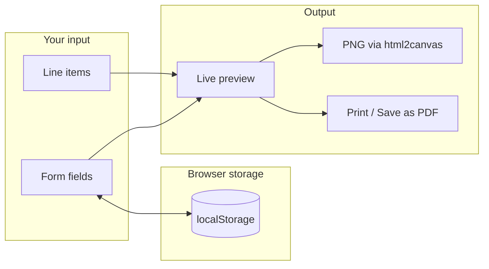

<div align="center">


# Invoice Generator

**Create polished invoices in the browser** — live preview, collapsible editor sections, PNG export, and print-to-PDF using only HTML, CSS, and JavaScript.

[](LICENSE)
[](index.html)

</div>

---

## What this project is

Invoice Generator is a **single-page, static web app** for drafting invoices without accounts, servers, or build tools. You fill in company and client details, add line items, adjust tax and discount percentages, and watch a **print-style preview** update in real time on the right side of the layout.

Everything runs in the visitor’s browser. There is **no backend**, **no database**, and **no API** — which keeps deployment as simple as hosting a folder of files on any static host (GitHub Pages, Netlify, S3, your own web server, or even opening `index.html` from disk).

---

## Why you might use it

- You want a **quick invoice layout** without subscribing to billing software.
- You need a **starting template** you can fork and rebrand (MIT licensed).
- You prefer **offline-capable** tooling once the page is loaded (CDN scripts still require network on first load unless you vendor them).
- You want **PNG snapshots** of the invoice for email or chat, plus **vector-friendly workflow** via the browser’s print-to-PDF path.

---

## Overview

The interface splits into two main columns on wide viewports:

1. **Editor (left)** — A glass-style card containing collapsible groups for company information, invoice metadata, line items, and totals/footer controls. Action buttons at the bottom trigger print and PNG export.
2. **Preview (right)** — A white “document” region that mirrors what you will print or rasterize to PNG. A small toolbar above the preview offers **Copy total** and **Focus preview**.

On smaller screens the layout stacks vertically; the preview remains usable for checking totals before export.



---

## Features

| Feature | Description |
| ------- | ----------- |
| **Collapsible panels** | Company, invoice, line items, and totals/footer are implemented with native `<details>` / `<summary>` so you can expand only the section you are editing. |
| **Live preview** | The preview DOM is updated on `input` / `change` events so numbers and copy stay aligned with the form. |
| **Preview toolbar** | **Copy total** copies the formatted grand total to the clipboard (with a fallback for older environments). **Focus preview** scrolls the invoice into view smoothly. |
| **Company logo** | Image upload with optional **natural**, **circle**, or **square** presentation in the preview. |
| **Currencies** | USD, EUR, GBP, INR, and JPY with symbol mapping in the totals and line table. |
| **Tax and discount** | Both are **percentage of subtotal**; grand total is `subtotal + tax − discount`. |
| **Payment status** | Shown on the preview with distinct colors (unpaid, paid, overdue, draft). |
| **Footer** | Optional thank-you line and terms; can be hidden from the preview and print output via a checkbox. |
| **Persistence** | Selected company settings, tax/discount defaults, footer text, logo shape preference, and logo image (base64) are stored in `localStorage`. |
| **Export** | **Save PDF** and **Print** open the system print dialog (choose a PDF printer or “Save as PDF”). **Save PNG** captures the preview using html2canvas at higher scale for sharper output. |
| **Motion** | Optional GSAP entrance animation for the two main cards when the page loads. |

---

## Requirements

- A **modern desktop or mobile browser** with JavaScript enabled (recent Chrome, Edge, Firefox, or Safari).
- **Network access on first load** if you use the default CDN links for GSAP, html2canvas, and Google Fonts. For fully offline use you would need to download those assets and update the `<script>` / `<link>` tags in `index.html`.

---

## Quick start

1. Clone this repository or download the project folder as a ZIP.
2. Open **`index.html`** in your browser by double-clicking it or using **File → Open**.

That is enough to use the app end-to-end in most environments.

### Optional: serve over HTTP

Some browsers apply stricter rules to **clipboard** APIs and occasionally to **canvas** export when the page is opened as `file://`. If **Copy total** or **Save PNG** misbehaves, serve the directory with any static file server. From the project root:

```bash
npx --yes serve .
```

Open the URL printed in the terminal (commonly `http://localhost:3000`) and load `index.html` from there.

Equivalent options include `python -m http.server`, VS Code “Live Server”, or uploading the folder to any static host.

---

## Using the form (field by field)

### Company details

- **Company logo** — Choose an image file; it is read as a data URL and shown in the preview. The last uploaded logo is also written to `localStorage` so it reappears on the next visit.
- **Logo shape** — Controls CSS classes on the preview image: full aspect (**Natural**), circular crop, or rounded square crop.
- **Company name / address** — Plain text shown in the preview header. Empty company name hides the large heading in the preview (placeholder layout still behaves sensibly).

### Invoice details

- **Invoice #** — Free text; displayed with a `#` prefix in the preview when non-empty.
- **Date** — HTML `date` input; defaults to today on first load (set in `script.js` on `DOMContentLoaded`).
- **Currency** — Drives the symbol used in line amounts, subtotal, tax, discount, and grand total.
- **Customer name / address** — Bill-to block in the preview; empty address lines can be hidden in the preview logic.
- **Payment status** — Affects label text and color in the preview status column.

### Line items

Enter **description**, **quantity**, and **unit price**, then click **Add item**. Each row appears in a list under the inputs with a delete control. Validation rejects missing names, non-numeric values, and non-positive quantity or price, and shows a short toast-style notification.

Line items are **kept in memory only** (JavaScript array). They are **not** written to `localStorage`, so refreshing the page clears the table. That keeps the app simple and avoids accidental reuse of old line items across invoices; you can change this in `script.js` if your workflow needs persistence.

### Totals and footer

- **Tax (%)** and **Discount (%)** — Applied to the **subtotal** of line items (not per-line tax modes).
- **Show footer in invoice** — Toggles visibility of the footer block in both the preview and the footer-related inputs in the form.
- **Thank you note** and **Terms & instructions** — Centered footer copy on the invoice.

---

## Preview toolbar

The strip above the invoice preview is screen-only (hidden when printing):

| Control | Behavior |
| ------- | -------- |
| **Copy total** | Reads the text of the grand total element and copies it to the clipboard. Uses the Async Clipboard API when available; otherwise falls back to a temporary `<textarea>` and `document.execCommand('copy')`. |
| **Focus preview** | Calls `scrollIntoView({ behavior: 'smooth' })` on the preview container so you can jump back to the document after a long form. |

---

## Data persistence (`localStorage`)

The script stores two keys:

| Key | Contents |
| --- | -------- |
| `zoho_invoice_settings` | JSON object: company name/address, currency, tax %, discount %, logo shape, thank-you and terms strings, and whether the footer is shown. |
| `zoho_invoice_logo` | Base64 data URL of the uploaded logo image. |

**Not persisted:** invoice number, service date, customer fields, payment status, line items, and the live preview state beyond what is reconstructed from the above on load.

To reset stored data, clear site data for the origin in your browser settings or remove those keys from the developer tools **Application** / **Storage** panel.

---

## Export behavior

### Print and “Save PDF”

Both **Print** and **Save PDF** call `window.print()`. The stylesheet includes a **`@media print`** block that:

- Hides the left-hand editor card, buttons, brand header, and form sections.
- Removes glass shadows and background gradients so the output is a clean white page centered on the invoice preview.

From the print dialog, choose **Save as PDF** (name varies by OS: “Microsoft Print to PDF”, “Save to PDF”, etc.) to produce a PDF. The exact paper size and margins depend on the browser and printer driver.

### Save PNG

**Save PNG** runs html2canvas against the `#invoicePreview` element with `scale: 2` and a white background for consistent edges. The download filename uses the invoice number field when set, otherwise a default fragment such as `001`.

Large logos or very tall invoices may increase capture time or memory use; if capture fails, an error notification is shown and details are logged to the browser console.

---

## Layout and responsive design

- **Wide layout** (`index.css`): two-column grid with max width around `1200px`, generous padding, and a **sticky** preview card so the document stays in view while scrolling the form when possible.
- **Narrow layout**: single column; preview is no longer sticky so mobile users scroll naturally through editor then invoice.
- **Print layout**: single-column invoice only, independent of the on-screen grid.

---

## Customization

- **Branding** — The visible product name appears in `index.html` (brand header and `<title>`). This repository is **not affiliated** with Zoho; rename strings there for your own product or client deliverable.
- **Colors and typography** — CSS custom properties at the top of `index.css` (`:root`) control the palette, glass effect, and text colors. The body font is Outfit from Google Fonts; swap the font link and `font-family` if you prefer another typeface.
- **Currencies** — Extend `currencySymbols` in `script.js` and add matching `<option>` elements in the currency `<select>` in `index.html`.
- **Animation** — GSAP runs only if `window.gsap` is defined; removing the GSAP script tag disables the entrance animation without breaking the rest of the app.

---

## Project layout (reference)

| Path | Responsibility |
| ---- | ---------------- |
| [`index.html`](index.html) | Document structure: meta, CDN includes, editor card with collapsible sections, preview card with toolbar and invoice markup. |
| [`index.css`](index.css) | Global styles, glass card layout, form controls, invoice preview typography, item list, toolbar buttons, responsive breakpoints, and print rules. |
| [`script.js`](script.js) | Event wiring, `addItem` / `deleteItem`, `updatePreview`, `localStorage` load/save, GSAP entrance, html2canvas PNG export, clipboard helpers, toast notifications. |
| [`assets/readme-hero.svg`](assets/readme-hero.svg) | Vector banner used at the top of this README. |
| [`LICENSE`](LICENSE) | MIT license text and copyright notice. |

There is no `package.json` and no compile step; what you see in the repository is what the browser loads.

---

## Troubleshooting

| Symptom | Things to try |
| ------- | ---------------- |
| **Copy total** does nothing or shows an error | Serve the site over `http://localhost` or HTTPS instead of `file://`, or manually select and copy the grand total from the preview. |
| **Save PNG** fails or is blank | Check the browser console for html2canvas errors; try a smaller logo, fewer line items, or HTTP hosting as above. |
| **Print preview** shows the whole page | Ensure you are on the latest `index.css`; print rules should hide the editor. Hard-refresh to avoid cached CSS. |
| **Logo missing after reopening** | Very large images make huge `localStorage` values; some browsers quota-throttle. Use a reasonably sized PNG or JPEG. |
| **Fonts look different offline** | Google Fonts requires network; embed or self-host font files for offline parity. |

---

## Privacy and security

All processing happens **in the user’s browser**. Form data and generated images are not sent to a server by this project’s code. Third-party CDNs (Cloudflare cdnjs, Google Fonts, GSAP CDN) receive normal HTTP requests when those resources load; review their privacy policies if that matters for your deployment. For maximum control, vendor those files locally and change the URLs in `index.html`.

---

## Tech stack

| Piece | Role |
| ----- | ---- |
| [GSAP](https://greensock.com/gsap/) | Lightweight entrance animation for the two main cards. |
| [html2canvas](https://html2canvas.hertzen.com/) | Rasterizes the DOM preview to a PNG for download. |
| [Outfit](https://fonts.google.com/specimen/Outfit) | UI and invoice body font. |

---

## License

This project is released under the **MIT License**. See [`LICENSE`](LICENSE) for the full text.

You may use, copy, modify, merge, publish, distribute, sublicense, and/or sell copies of the Software, subject to the conditions in the license (including retaining the copyright notice and permission notice in substantial portions). If you publish a fork under different authorship, update the copyright line in `LICENSE` accordingly.

---

## Disclaimer

The string **“ZOHO INVOICE”** in the user interface is **decorative naming only**. This project is **not** affiliated with, endorsed by, or connected to Zoho Corporation or its products. Replace that branding in `index.html` for production or public deployments if you require a neutral or accurate product name.
